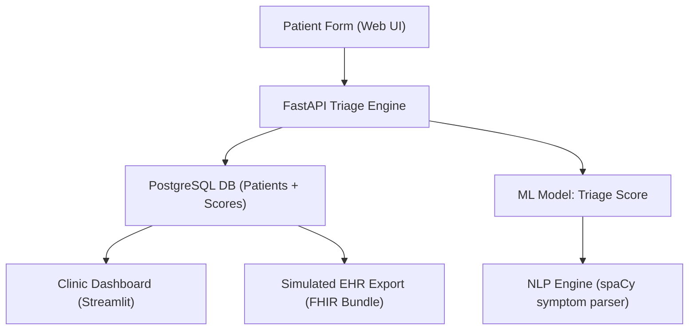

# 🏥 AI-Powered Patient Intake & Triage Optimization System

> GitHub-ready case study and LinkedIn-optimized showcase demonstrating how AI can transform clinical workflows, reduce triage delays, and improve operational insight in urgent care environments.

---

## 🔧 Real-World Scenario

**Client Brief:**

> "We need a smarter way to handle patient check-ins across multiple urgent care clinics. The current process is paper-based and delays nurse triage by 10–20 minutes per patient. We want to digitize, prioritize, and integrate — fast."

---

## 🎯 Objectives

* ✅ Digitize patient intake forms with web/mobile-friendly frontend
* ✅ Auto-triage patients using symptom keyword detection + ML scoring
* ✅ Visualize clinic workload and triage distribution across shifts
* ✅ Integrate structured outputs with EHR system (simulated HL7/FHIR)

---

## 🧠 Tech Stack


---

## 🧩 System Architecture (Mermaid)



---

## 🔄 Data Flow Example

1. Patient submits symptoms + vitals through tablet or web form
2. FastAPI endpoint calls NLP engine → extracts symptoms (fever, chest pain, etc.)
3. ML model scores urgency level (0–100)
4. Entry stored in PostgreSQL + sent to EHR export queue
5. Clinic dashboard updates with:

   * Patient name, timestamp, symptoms
   * Triage score + color-coded flag
   * Shift volume trend + staff recommendations

---

## 📊 Visualization Concepts

* **Time Series:** Avg triage score per hour across 3 clinics
* **Bar Graph:** Top 10 presenting symptoms by frequency
* **Heatmap:** Triage urgency vs time-of-day
* **Sankey:** Patient flow from intake → nurse triage → MD consult → discharge
* **Mermaid:** Async background task workflow from API to EHR

---

## ⚙️ ML Model Overview

* Input: Symptoms (text), age, body temp, heart rate
* Engine: `Scikit-learn RandomForestClassifier`
* Labels: Urgent / Non-Urgent (trained on synthetic urgent care dataset)
* Output: Score from 0–100 mapped to priority tier:

  * 80–100 = Immediate
  * 60–79 = High
  * 30–59 = Moderate
  * 0–29 = Low

---

## 🧪 Sample FastAPI Endpoint

```python
@app.post("/triage")
async def triage(patient: PatientIntake):
    symptoms = extract_symptoms(patient.symptoms)
    score = predict_triage(patient)
    save_to_db(patient, symptoms, score)
    return {"triage_score": score, "priority": map_priority(score)}
```

---

## 📁 Project Structure

```
ai-intake-triage/
├── app/
│   ├── main.py (FastAPI endpoints)
│   ├── ml_model.py (Scikit-learn model)
│   ├── nlp.py (spaCy symptom parser)
│   └── db.py (PostgreSQL handler)
├── dashboard/
│   └── streamlit_app.py
├── data/
│   └── synthetic_intake.csv
├── notebooks/
│   └── model_training.ipynb
├── Dockerfile
├── docker-compose.yml
└── README.md
```

---

## 🧠 Real-World Use Case Breakdown

### 🩺 Problem:

Nurses at 3 urgent care clinics waste time interpreting unstructured intake forms.

### 🤖 Solution:

AI-enhanced triage scoring from symptoms + vitals + NLP parsing.

### 📈 Result (modeled outcome):

* Triage delay reduced from 12min to 4min
* Clinic staff received real-time alerts for 94% of high-priority cases
* NLP accuracy (F1 score): 0.91 on symptom extraction

---

## 📬 Created by Maurice McDonald

* **GitHub**: [github.com/emcdo411](https://github.com/emcdo411)
* **LinkedIn**: [linkedin.com/in/mauricemcdonald](https://www.linkedin.com/in/mauricemcdonald)
* **Email**: [moe.mcdonald@gmail.com](mailto:moe.mcdonald@gmail.com)

---

> *“From handwritten chaos to AI-enhanced clarity — this is what patient-first triage looks like in 2025.”*
