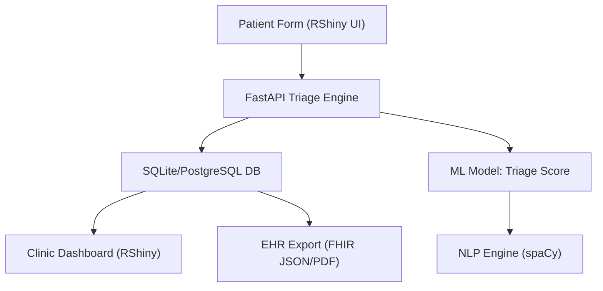

🧠 **AI-Powered Patient Intake & Triage Optimization System**

> GitHub-ready case study and LinkedIn-worthy demo showcasing how AI and R Shiny modernize urgent care workflows.

---

## 📌 Summary

This project delivers a production-ready, R-based AI intake and triage system for urgent care clinics. It replaces manual, paper-based forms with a sleek Shiny dashboard, assigns triage scores using AI models, and visualizes trends in patient flow, symptom frequency, and care priority. Compatible with real-time API integration or `.csv` uploads, this app is tailored for both demo and real-world settings.

---

## 🌟 Why This Matters

| Benefit              | Impact                                                 |
| -------------------- | ------------------------------------------------------ |
| ⏱️ Faster Triage     | From 10–20 min delay ➜ \~4 min using AI-driven scoring |
| 🔍 Visual Insights   | Reveal trends in symptoms, priority loads, peak hours  |
| 💡 Smarter Decisions | Triage scores flag urgent cases before MD evaluation   |
| 💻 R + FastAPI Ready | Works with EHR or in demo mode, locally or in cloud    |

---

## 🚀 Features

✅ **Digital Intake Form**
✅ **AI Triage Scoring (0–100)**
✅ **Live API + CSV Upload Modes**
✅ **Fallback to Predictive Scoring**
✅ **Bar, Histogram, Wordcloud, Table Outputs**
✅ **PDF Summary Report Export**
✅ **Dark Theme + Accessibility**

---

## 🧰 Tech Stack


---

## 🧱 System Architecture



---

## 📦 Project Structure

```
ai-intake-triage/
├── app/
│   ├── main.py           # FastAPI endpoint
│   ├── ml_model.py       # ML model logic
│   ├── nlp.py            # Symptom parsing
│   └── db.py             # SQLite/PostgreSQL handler
├── dashboard/
│   └── app.R             # R Shiny frontend
├── data/
│   └── synthetic_intake.csv
├── notebooks/
│   └── model_training.ipynb
├── Dockerfile
├── docker-compose.yml
└── README.md
```

---

## 🛠️ Installation

**R + Shiny Setup:**

```r
install.packages(c("shiny", "shinydashboard", "shinyWidgets", "DT", "plotly", "wordcloud2", "rmarkdown", "knitr", "httr", "jsonlite", "shinyFeedback"))
```

**FastAPI (Optional):**

```bash
pip install fastapi uvicorn scikit-learn spacy pydantic sqlalchemy psycopg2-binary
python -m spacy download en_core_web_sm
```

---

## 🌐 API Integration (Optional)

**Endpoint (FastAPI)**

```python
@app.post("/triage")
async def triage(patient: PatientIntake):
    symptoms = extract_symptoms(patient.symptoms)
    score = predict_triage(...)
    return {"triage_score": score, "priority": priority}
```

RShiny communicates via:

```r
res <- httr::POST(api_url, body = patient_data, encode = "json")
```

---

## 📊 Visualization Examples

| Module             | Output Type             |
| ------------------ | ----------------------- |
| Triage Scores      | Bar Plot (plotly)       |
| Symptom Frequency  | Word Cloud (wordcloud2) |
| Score Distribution | Histogram (plotly)      |
| Full Dataset       | DT::datatable           |
| Raw API Result     | JSON Pretty Print       |
| Summary            | Downloadable PDF        |

---

## 🧠 Example Use Case

> A nurse enters "fever, cough" with vitals 100.5°F and 90 bpm for a 30yo.
>
> The system assigns a triage score of **60.5%**, flags it as **Medium Priority**, and adds it to the real-time dashboard for medical staff.

---

## ✅ How to Run

```r
shiny::runApp("dashboard")
```

Or with Docker (R + FastAPI combo):

```bash
docker-compose up --build
```

---

## 📬 Author

**Maurice McDonald**
[github.com/emcdo411](https://github.com/emcdo411)
[linkedin.com/in/mauricemcdonald](https://www.linkedin.com/in/mauricemcdonald)
[moe.mcdonald@gmail.com](mailto:moe.mcdonald@gmail.com)

---

> "From handwritten chaos to AI-enhanced clarity — this is patient-first triage in 2025."


