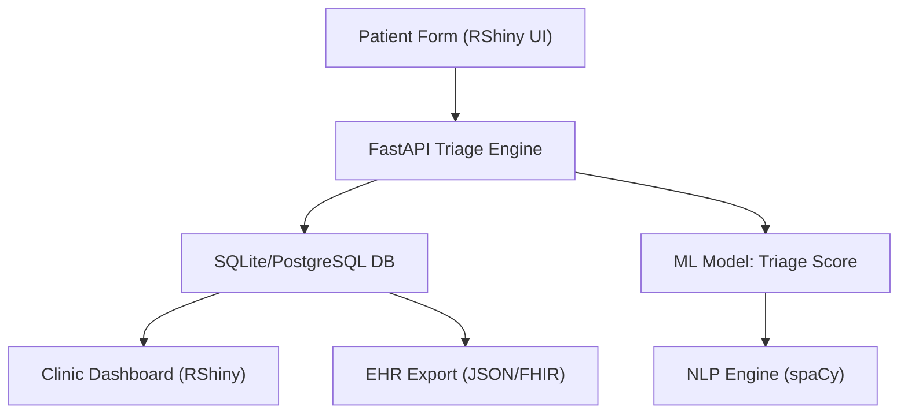

# 🧐 AI-Powered Patient Intake & Triage Optimization System

> GitHub-ready case study and LinkedIn-optimized showcase demonstrating how AI can transform clinical workflows, reduce triage delays, and improve operational insight in urgent care environments.

---

## 🔧 Real-World Scenario

**Client Brief:**

> "We need a smarter way to handle patient check-ins across multiple urgent care clinics. The current process is paper-based and delays nurse triage by 10–20 minutes per patient. We want to digitize, prioritize, and integrate — fast."

---

## 🌟 Objectives

* ✅ Digitize patient intake forms with web/mobile-friendly frontend
* ✅ Auto-triage patients using symptom keyword detection + ML scoring
* ✅ Visualize clinic workload and triage distribution across shifts
* ✅ Integrate structured outputs with EHR system (simulated HL7/FHIR)

---

## 🤭 Tech Stack


---

## 🧹 System Architecture (Mermaid)



---

## 📦 Full RShiny Code

```r
<# Load required packages
required_packages <- c("shiny", "shinydashboard", "shinyWidgets", "DT", "plotly", "wordcloud2", "rmarkdown", "knitr", "httr", "jsonlite", "shinyFeedback")
for (pkg in required_packages) {
  if (!requireNamespace(pkg, quietly = TRUE)) {
    tryCatch({
      install.packages(pkg, dependencies = TRUE, repos = "https://cran.rstudio.com/", quiet = TRUE)
      cat("Installed package:", pkg, "\n")
    }, error = function(e) {
      cat(sprintf("Failed to install %s: %s\n", pkg, conditionMessage(e)))
    })
  }
  tryCatch({
    suppressPackageStartupMessages(library(pkg, character.only = TRUE))
    cat("Loaded package:", pkg, "\n")
  }, error = function(e) {
    cat(sprintf("Failed to load %s: %s; using fallback if applicable\n", pkg, conditionMessage(e)))
  })
}

# Check package availability
use_shinydashboard <- requireNamespace("shinydashboard", quietly = TRUE)
use_shinyWidgets <- requireNamespace("shinyWidgets", quietly = TRUE)
use_DT <- requireNamespace("DT", quietly = TRUE)
use_plotly <- requireNamespace("plotly", quietly = TRUE)

# Define UI
if (use_shinydashboard) {
  ui <- shinydashboard::dashboardPage(
    skin = "black",
    shinydashboard::dashboardHeader(title = "🩺 Triage Dashboard", titleWidth = 300),
    shinydashboard::dashboardSidebar(
      width = 300,
      shinydashboard::sidebarMenu(
        shinydashboard::menuItem("Input", tabName = "input", icon = shiny::icon("edit")),
        shinydashboard::menuItem("Results", tabName = "output", icon = shiny::icon("chart-bar"))
      )
    ),
    shinydashboard::dashboardBody(
      tags$head(
        tags$link(rel = "stylesheet", href = "https://cdnjs.cloudflare.com/ajax/libs/font-awesome/6.5.1/css/all.min.css"),
        tags$style(HTML("
          body { background-color: #2A2E39; color: #FFFFFF; font-family: Arial, sans-serif; }
          .main-header .logo { background-color: #005B82; color: #FFFFFF; }
          .sidebar { background-color: #2A2E39; }
          .content-wrapper { background-color: #2A2E39; }
          .box { background-color: #3B404F; border: none; border-radius: 6px; box-shadow: 0 2px 4px rgba(0,0,0,0.2); }
          .form-control:invalid { border: 2px solid #E63946; }
          .tooltip { position: relative; display: inline-block; }
          .tooltip .tooltiptext {
            visibility: hidden; width: 200px; background-color: #005B82; color: #FFFFFF;
            text-align: center; border-radius: 6px; padding: 5px; position: absolute;
            z-index: 1; bottom: 125%; left: 50%; margin-left: -100px; opacity: 0;
            transition: opacity 0.3s;
          }
          .tooltip:hover .tooltiptext { visibility: visible; opacity: 1; }
          .value-box { background-color: #3B404F !important; color: #FFFFFF !important; }
          .shiny-table, .shiny-plot { background-color: #2A2E39; border: 1px solid #FFFFFF; color: #FFFFFF; }
          .shiny-table th, .shiny-table td { padding: 8px; text-align: center; }
          .shiny-table th { background-color: #005B82; }
        "))
      ),
      shinydashboard::tabItems(
        shinydashboard::tabItem(tabName = "input",
                                shinydashboard::box(
                                  title = "Triage Input",
                                  width = 12,
                                  status = "primary",
                                  solidHeader = TRUE,
                                  tags$div(
                                    `aria-label` = "Select data mode",
                                    if (use_shinyWidgets) {
                                      shinyWidgets::prettyRadioButtons(
                                        inputId = "mode",
                                        label = "Data Mode:",
                                        choices = c("Live API", "Upload CSV"),
                                        icon = shiny::icon("check"),
                                        selected = "Live API",
                                        status = "primary",
                                        inline = TRUE
                                      )
                                    } else {
                                      shiny::radioButtons(
                                        inputId = "mode",
                                        label = "Data Mode:",
                                        choices = c("Live API", "Upload CSV"),
                                        selected = "Live API",
                                        inline = TRUE
                                      )
                                    }
                                  ),
                                  shiny::conditionalPanel(
                                    condition = "input.mode == 'Upload CSV'",
                                    tags$div(
                                      `aria-label` = "Upload CSV file",
                                      shiny::fileInput("file", "Upload Intake CSV", accept = ".csv")
                                    ),
                                    tags$div(
                                      `aria-label` = "Download CSV template",
                                      shiny::downloadButton("download_template", "Download CSV Template", style = "background-color: #005B82; color: #FFFFFF; border-radius: 6px;")
                                    )
                                  ),
                                  shiny::conditionalPanel(
                                    condition = "input.mode == 'Live API'",
                                    tags$div(class = "tooltip",
                                             `aria-label` = "Enter API URL",
                                             shiny::textInput("api_url", "API URL", value = "http://localhost:8000/triage", placeholder = "e.g., http://localhost:8000/triage"),
                                             tags$span(class = "tooltiptext", "Enter the triage API endpoint URL")
                                    ),
                                    tags$div(class = "tooltip",
                                             `aria-label` = "Enter symptoms",
                                             shiny::textInput("symptoms", "📝 Symptoms", placeholder = "e.g., chest pain, shortness of breath", value = ""),
                                             tags$span(class = "tooltiptext", "Enter symptoms separated by commas")
                                    ),
                                    tags$div(class = "tooltip",
                                             `aria-label` = "Enter age",
                                             shiny::numericInput("age", "🎂 Age", value = NULL, min = 0, max = 120),
                                             tags$span(class = "tooltiptext", "Enter patient age (0-120)")
                                    ),
                                    tags$div(class = "tooltip",
                                             `aria-label` = "Enter temperature in Fahrenheit",
                                             shiny::numericInput("temperature", "🌡️ Temperature (°F)", value = NULL, min = 95, max = 108, step = 0.1),
                                             tags$span(class = "tooltiptext", "Enter temperature in °F (95-108)")
                                    ),
                                    tags$div(class = "tooltip",
                                             `aria-label` = "Enter heart rate",
                                             shiny::numericInput("heart_rate", "❤️ Heart Rate", value = NULL, min = 30, max = 200),
                                             tags$span(class = "tooltiptext", "Enter heart rate in beats per minute (30-200)")
                                    ),
                                    if (use_DT) {
                                      DT::DTOutput("input_history", width = "100%")
                                    } else {
                                      shiny::tableOutput("input_history")
                                    }
                                  ),
                                  tags$div(
                                    `aria-label` = "Submit triage data",
                                    shiny::actionButton("submit", "Submit", icon = shiny::icon("paper-plane"), style = "background-color: #005B82; color: #FFFFFF; border-radius: 6px;")
                                  )
                                )
        ),
        shinydashboard::tabItem(tabName = "output",
                                shiny::fluidRow(
                                  shinydashboard::valueBoxOutput("score_box", width = 4),
                                  shinydashboard::valueBoxOutput("priority_box", width = 4),
                                  shinydashboard::valueBoxOutput("symptom_count_box", width = 4)
                                ),
                                shinydashboard::box(
                                  title = "Results",
                                  width = 12,
                                  status = "primary",
                                  solidHeader = TRUE,
                                  shiny::tabsetPanel(
                                    shiny::tabPanel("📊 Data Table", if (use_DT) DT::DTOutput("table") else shiny::tableOutput("table")),
                                    shiny::tabPanel("📈 Triage Score", if (use_plotly) plotly::plotlyOutput("scorePlot", height = "400px") else shiny::plotOutput("scorePlot", height = "400px", bg = "#2A2E39")),
                                    shiny::tabPanel("☁️ Symptom Cloud", wordcloud2::wordcloud2Output("symptomCloud", height = "400px")),
                                    shiny::tabPanel("📊 Score Distribution", if (use_plotly) plotly::plotlyOutput("scoreDistPlot", height = "400px") else shiny::plotOutput("scoreDistPlot", height = "400px", bg = "#2A2E39")),
                                    shiny::tabPanel("📦 Raw JSON", shiny::verbatimTextOutput("jsonOut")),
                                    shiny::tabPanel("📄 Report", shiny::downloadButton("download_report", "Download Report", style = "background-color: #005B82; color: #FFFFFF; border-radius: 6px;"))
                                  )
                                )
        )
      )
    )
  )
} else {
  cat("Using fallback fluidPage UI\n")
  ui <- shiny::fluidPage(
    tags$head(
      tags$link(rel = "stylesheet", href = "https://cdnjs.cloudflare.com/ajax/libs/font-awesome/6.5.1/css/all.min.css"),
      tags$style(HTML("
        body { background-color: #2A2E39; color: #FFFFFF; font-family: Arial, sans-serif; }
        .panel { background-color: #3B404F; border-radius: 6px; padding: 15px; margin-bottom: 20px; box-shadow: 0 2px 4px rgba(0,0,0,0.2); }
        .form-control:invalid { border: 2px solid #E63946; }
        .tooltip { position: relative; display: inline-block; }
        .tooltip .tooltiptext {
          visibility: hidden; width: 200px; background-color: #005B82; color: #FFFFFF;
          text-align: center; border-radius: 6px; padding: 5px; position: absolute;
          z-index: 1; bottom: 125%; left: 50%; margin-left: -100px; opacity: 0;
          transition: opacity 0.3s;
        }
        .tooltip:hover .tooltiptext { visibility: visible; opacity: 1; }
        .value-box { background-color: #3B404F; color: #FFFFFF; padding: 10px; border-radius: 6px; text-align: center; }
        .shiny-table, .shiny-plot { background-color: #2A2E39; border: 1px solid #FFFFFF; color: #FFFFFF; }
        .shiny-table th, .shiny-table td { padding: 8px; text-align: center; }
        .shiny-table th { background-color: #005B82; }
      "))
    ),
    shiny::titlePanel("🩺 Triage Dashboard"),
    shiny::fluidRow(
      shiny::column(3,
                    div(class = "panel",
                        h3("Triage Input"),
                        tags$div(
                          `aria-label` = "Select data mode",
                          if (use_shinyWidgets) {
                            shinyWidgets::prettyRadioButtons(
                              inputId = "mode",
                              label = "Data Mode:",
                              choices = c("Live API", "Upload CSV"),
                              icon = shiny::icon("check"),
                              selected = "Live API",
                              status = "primary",
                              inline = TRUE
                            )
                          } else {
                            shiny::radioButtons(
                              inputId = "mode",
                              label = "Data Mode:",
                              choices = c("Live API", "Upload CSV"),
                              selected = "Live API",
                              inline = TRUE
                            )
                          }
                        ),
                        shiny::conditionalPanel(
                          condition = "input.mode == 'Upload CSV'",
                          tags$div(
                            `aria-label` = "Upload CSV file",
                            shiny::fileInput("file", "Upload Intake CSV", accept = ".csv")
                          ),
                          tags$div(
                            `aria-label` = "Download CSV template",
                            shiny::downloadButton("download_template", "Download CSV Template", style = "background-color: #005B82; color: #FFFFFF; border-radius: 6px;")
                          )
                        ),
                        shiny::conditionalPanel(
                          condition = "input.mode == 'Live API'",
                          tags$div(class = "tooltip",
                                   `aria-label` = "Enter API URL",
                                   shiny::textInput("api_url", "API URL", value = "http://localhost:8000/triage", placeholder = "e.g., http://localhost:8000/triage"),
                                   tags$span(class = "tooltiptext", "Enter the triage API endpoint URL")
                          ),
                          tags$div(class = "tooltip",
                                   `aria-label` = "Enter symptoms",
                                   shiny::textInput("symptoms", "📝 Symptoms", placeholder = "e.g., chest pain, shortness of breath", value = ""),
                                   tags$span(class = "tooltiptext", "Enter symptoms separated by commas")
                          ),
                          tags$div(class = "tooltip",
                                   `aria-label` = "Enter age",
                                   shiny::numericInput("age", "🎂 Age", value = NULL, min = 0, max = 120),
                                   tags$span(class = "tooltiptext", "Enter patient age (0-120)")
                          ),
                          tags$div(class = "tooltip",
                                   `aria-label` = "Enter temperature in Fahrenheit",
                                   shiny::numericInput("temperature", "🌡️ Temperature (°F)", value = NULL, min = 95, max = 108, step = 0.1),
                                   tags$span(class = "tooltiptext", "Enter temperature in °F (95-108)")
                          ),
                          tags$div(class = "tooltip",
                                   `aria-label` = "Enter heart rate",
                                   shiny::numericInput("heart_rate", "❤️ Heart Rate", value = NULL, min = 30, max = 200),
                                   tags$span(class = "tooltiptext", "Enter heart rate in beats per minute (30-200)")
                          ),
                          if (use_DT) {
                            DT::DTOutput("input_history", width = "100%")
                          } else {
                            shiny::tableOutput("input_history")
                          }
                        ),
                        tags$div(
                          `aria-label` = "Submit triage data",
                          shiny::actionButton("submit", "Submit", icon = shiny::icon("paper-plane"), style = "background-color: #005B82; color: #FFFFFF; border-radius: 6px;")
                        )
                    )
      ),
      shiny::column(9,
                    div(class = "panel",
                        h3("Results"),
                        shiny::fluidRow(
                          shiny::column(4, shiny::uiOutput("score_box")),
                          shiny::column(4, shiny::uiOutput("priority_box")),
                          shiny::column(4, shiny::uiOutput("symptom_count_box"))
                        ),
                        shiny::tabsetPanel(
                          shiny::tabPanel("📊 Data Table", if (use_DT) DT::DTOutput("table") else shiny::tableOutput("table")),
                          shiny::tabPanel("📈 Triage Score", if (use_plotly) plotly::plotlyOutput("scorePlot", height = "400px") else shiny::plotOutput("scorePlot", height = "400px", bg = "#2A2E39")),
                          shiny::tabPanel("☁️ Symptom Cloud", wordcloud2::wordcloud2Output("symptomCloud", height = "400px")),
                          shiny::tabPanel("📊 Score Distribution", if (use_plotly) plotly::plotlyOutput("scoreDistPlot", height = "400px") else shiny::plotOutput("scoreDistPlot", height = "400px", bg = "#2A2E39")),
                          shiny::tabPanel("📦 Raw JSON", shiny::verbatimTextOutput("jsonOut")),
                          shiny::tabPanel("📄 Report", shiny::downloadButton("download_report", "Download Report", style = "background-color: #005B82; color: #FFFFFF; border-radius: 6px;"))
                        )
                    )
      )
    )
  )
}

# Define Server
server <- function(input, output, session) {
  # Hardcoded sample data
  sample_data <- data.frame(
    symptoms = c("chest pain, shortness of breath", "fever, cough", "headache, fatigue", "abdominal pain, nausea", "back pain, fever"),
    triage_score = c(85.2, 60.5, 45.8, 70.1, 55.3),
    priority = c("High", "Medium", "Low", "Medium", "Low"),
    age = c(55, 30, 25, 40, 65),
    temperature = c(101.2, 100.5, 98.6, 99.8, 100.1),
    heart_rate = c(110, 90, 75, 100, 85),
    stringsAsFactors = FALSE
  )
  
  # Initialize reactive values with sample data
  results <- reactiveVal(sample_data)
  input_history <- reactiveVal(data.frame(
    Timestamp = character(),
    Symptoms = character(),
    Age = numeric(),
    Temperature = numeric(),
    Heart_Rate = numeric(),
    stringsAsFactors = FALSE
  ))
  
  # Input sanitization and validation
  sanitize_symptoms <- function(symptoms) {
    if (is.null(symptoms) || trimws(symptoms) == "") return("")
    trimws(gsub("[^a-zA-Z0-9,\\s]", "", symptoms)) |> 
      gsub("\\s*,\\s*", ", ", x = _)
  }
  
  validate_inputs <- function() {
    errors <- character()
    if (input$mode == "Live API") {
      if (!grepl("^https?://", input$api_url)) {
        errors <- c(errors, "Invalid API URL")
        shinyFeedback::showFeedbackWarning("api_url", "Enter a valid URL (e.g., http://localhost:8000/triage)")
      } else {
        shinyFeedback::hideFeedback("api_url")
      }
      if (trimws(input$symptoms) == "") {
        errors <- c(errors, "Symptoms required")
        shinyFeedback::showFeedbackWarning("symptoms", "Enter symptoms")
      } else {
        shinyFeedback::hideFeedback("symptoms")
      }
      if (is.null(input$age) || is.na(input$age) || input$age < 0 || input$age > 120) {
        errors <- c(errors, "Age must be 0-120")
        shinyFeedback::showFeedbackWarning("age", "Enter age (0-120)")
      } else {
        shinyFeedback::hideFeedback("age")
      }
      if (is.null(input$temperature) || is.na(input$temperature) || input$temperature < 95 || input$temperature > 108) {
        errors <- c(errors, "Temperature must be 95-108°F")
        shinyFeedback::showFeedbackWarning("temperature", "Enter temperature (95-108°F)")
      } else {
        shinyFeedback::hideFeedback("temperature")
      }
      if (is.null(input$heart_rate) || is.na(input$heart_rate) || input$heart_rate < 30 || input$heart_rate > 200) {
        errors <- c(errors, "Heart rate must be 30-200")
        shinyFeedback::showFeedbackWarning("heart_rate", "Enter heart rate (30-200)")
      } else {
        shinyFeedback::hideFeedback("heart_rate")
      }
    }
    errors
  }
  
  # Predictive scoring
  predict_triage_score <- function(age, temperature, heart_rate, symptoms) {
    symptom_count <- length(unlist(strsplit(sanitize_symptoms(symptoms), ",\\s*")))
    severe_symptoms <- c("chest pain", "shortness of breath", "severe headache")
    symptoms <- unlist(strsplit(sanitize_symptoms(symptoms), ",\\s*"))
    severity_score <- sum(sapply(symptoms, function(s) if (s %in% severe_symptoms) 2 else 1))
    
    score <- -10 + 0.05 * age + 0.1 * temperature + 0.08 * heart_rate + 3 * symptom_count * severity_score
    score <- 100 / (1 + exp(-score))
    score <- min(max(score, 0), 100)
    priority <- if (score > 80) "High" else if (score > 50) "Medium" else "Low"
    list(score = round(score, 1), priority = priority)
  }
  
  # CSV template download
  output$download_template <- shiny::downloadHandler(
    filename = "triage_template.csv",
    content = function(file) {
      write.csv(sample_data, file, row.names = FALSE)
    }
  )
  
  # Input history table
  output$input_history <- if (use_DT) {
    DT::renderDT({
      DT::datatable(
        input_history(),
        options = list(pageLength = 5, dom = 't', columnDefs = list(list(className = 'dt-center', targets = '_all'))),
        style = "bootstrap",
        class = "table table-striped table-hover",
        rownames = FALSE,
        selection = "single",
        caption = "Recent Inputs"
      ) |> DT::formatRound(columns = c("Age", "Temperature", "Heart_Rate"), digits = 1)
    })
  } else {
    shiny::renderTable({
      input_history()
    }, rownames = FALSE, class = "shiny-table")
  }
  
  # Handle input history selection
  observeEvent(input$input_history_rows_selected, {
    if (!use_DT) return()
    req(input$input_history_rows_selected)
    selected <- input_history()[input$input_history_rows_selected, ]
    shiny::updateTextInput(session, "symptoms", value = selected$Symptoms)
    shiny::updateNumericInput(session, "age", value = selected$Age)
    shiny::updateNumericInput(session, "temperature", value = selected$Temperature)
    shiny::updateNumericInput(session, "heart_rate", value = selected$Heart_Rate)
  })
  
  # Symptom count
  symptom_count <- reactive({
    req(nrow(results()) > 0, "symptoms" %in% names(results()))
    length(unlist(strsplit(results()$symptoms[1], ",\\s*")))
  })
  
  # Submit button
  observeEvent(input$submit, {
    errors <- validate_inputs()
    if (length(errors) > 0) {
      showNotification(paste(errors, collapse = "; "), type = "error")
      return()
    }
    
    if (input$mode == "Live API") {
      tryCatch({
        body <- list(
          symptoms = sanitize_symptoms(input$symptoms),
          age = input$age,
          temperature = input$temperature,
          heart_rate = input$heart_rate
        )
        res <- httr::POST(input$api_url, body = body, encode = "json", httr::timeout(10))
        if (httr::status_code(res) != 200) stop("API error: status ", httr::status_code(res))
        json <- httr::content(res, as = "text", encoding = "UTF-8")
        df <- as.data.frame(jsonlite::fromJSON(json))
        if (!all(c("symptoms", "triage_score", "priority") %in% names(df))) {
          stop("API response missing required columns")
        }
        results(rbind(df, results())) # Append new data
        history <- input_history()
        new_entry <- data.frame(
          Timestamp = format(Sys.time(), "%Y-%m-%d %H:%M:%S"),
          Symptoms = sanitize_symptoms(input$symptoms),
          Age = input$age,
          Temperature = input$temperature,
          Heart_Rate = input$heart_rate
        )
        input_history(rbind(new_entry, head(history, 9)))
        showNotification("API data retrieved", type = "message")
      }, error = function(e) {
        pred <- predict_triage_score(input$age, input$temperature, input$heart_rate, input$symptoms)
        df <- data.frame(
          symptoms = sanitize_symptoms(input$symptoms),
          triage_score = pred$score,
          priority = pred$priority,
          age = input$age,
          temperature = input$temperature,
          heart_rate = input$heart_rate
        )
        results(rbind(df, results())) # Append new data
        history <- input_history()
        new_entry <- data.frame(
          Timestamp = format(Sys.time(), "%Y-%m-%d %H:%M:%S"),
          Symptoms = sanitize_symptoms(input$symptoms),
          Age = input$age,
          Temperature = input$temperature,
          Heart_Rate = input$heart_rate
        )
        input_history(rbind(new_entry, head(history, 9)))
        showNotification("Using sample data or predictive scoring due to API error", type = "warning")
      })
    } else {
      if (is.null(input$file)) {
        results(sample_data) # Use sample data if no file
        showNotification("No CSV uploaded; using sample data", type = "message")
      } else {
        tryCatch({
          df <- read.csv(input$file$datapath, stringsAsFactors = FALSE)
          if (!all(c("symptoms", "triage_score", "priority") %in% names(df))) {
            stop("CSV must have columns: symptoms, triage_score, priority")
          }
          df$triage_score <- as.numeric(df$triage_score)
          if (any(is.na(df$triage_score))) stop("Triage score must be numeric")
          df$symptoms <- vapply(df$symptoms, sanitize_symptoms, character(1))
          results(rbind(df, results())) # Append new data
          showNotification("CSV data loaded", type = "message")
        }, error = function(e) {
          results(sample_data) # Fallback to sample data
          showNotification("CSV error; using sample data", type = "error")
        })
      }
    }
  })
  
  # Value box outputs
  output$score_box <- if (use_shinydashboard) {
    shinydashboard::renderValueBox({
      req(nrow(results()) > 0)
      df <- results()
      shinydashboard::valueBox(
        value = if ("triage_score" %in% names(df)) paste0(round(df$triage_score[1], 1), "%") else "N/A",
        subtitle = "Triage Score",
        icon = shiny::icon("heartbeat"),
        color = if ("triage_score" %in% names(df)) "aqua" else "red"
      )
    })
  } else {
    shiny::renderUI({
      req(nrow(results()) > 0)
      df <- results()
      div(class = "value-box",
          h4(if ("triage_score" %in% names(df)) paste0(round(df$triage_score[1], 1), "%") else "N/A"),
          p("Triage Score"),
          tags$i(class = "fas fa-heartbeat", style = paste0("color: ", if ("triage_score" %in% names(df)) "#005B82" else "#E63946"))
      )
    })
  }
  
  output$priority_box <- if (use_shinydashboard) {
    shinydashboard::renderValueBox({
      req(nrow(results()) > 0)
      df <- results()
      shinydashboard::valueBox(
        value = if ("priority" %in% names(df)) df$priority[1] else "N/A",
        subtitle = "Priority Level",
        icon = shiny::icon("exclamation-triangle"),
        color = if ("priority" %in% names(df)) switch(df$priority[1], "High" = "red", "Medium" = "yellow", "Low" = "green", "aqua") else "red"
      )
    })
  } else {
    shiny::renderUI({
      req(nrow(results()) > 0)
      df <- results()
      div(class = "value-box",
          h4(if ("priority" %in% names(df)) df$priority[1] else "N/A"),
          p("Priority Level"),
          tags$i(class = "fas fa-exclamation-triangle", style = paste0("color: ", if ("priority" %in% names(df)) switch(df$priority[1], "High" = "#E63946", "Medium" = "#FFC107", "Low" = "#28A745", "#005B82") else "#E63946"))
      )
    })
  }
  
  output$symptom_count_box <- if (use_shinydashboard) {
    shinydashboard::renderValueBox({
      req(nrow(results()) > 0)
      count <- symptom_count()
      shinydashboard::valueBox(
        value = count,
        subtitle = "Reported Symptoms",
        icon = shiny::icon("notes-medical"),
        color = if (count > 0) "aqua" else "red"
      )
    })
  } else {
    shiny::renderUI({
      req(nrow(results()) > 0)
      count <- symptom_count()
      div(class = "value-box",
          h4(count),
          p("Reported Symptoms"),
          tags$i(class = "fas fa-notes-medical", style = paste0("color: ", if (count > 0) "#005B82" else "#E63946"))
      )
    })
  }
  
  output$jsonOut <- shiny::renderPrint({
    req(nrow(results()) > 0)
    results()
  })
  
  output$table <- if (use_DT) {
    DT::renderDT({
      req(nrow(results()) > 0)
      DT::datatable(
        results(),
        options = list(pageLength = 5, dom = 'Bfrtip', buttons = c('copy', 'csv'), columnDefs = list(list(className = 'dt-center', targets = '_all'))),
        extensions = "Buttons",
        style = "bootstrap",
        class = "table table-striped table-hover",
        rownames = FALSE
      ) |> DT::formatRound(columns = c("triage_score", "age", "temperature", "heart_rate"), digits = 1)
    })
  } else {
    shiny::renderTable({
      req(nrow(results()) > 0)
      results()
    }, rownames = FALSE, class = "shiny-table")
  }
  
  output$scorePlot <- if (use_plotly) {
    plotly::renderPlotly({
      req(nrow(results()) > 0)
      df <- results()
      if ("triage_score" %in% names(df)) {
        plotly::plot_ly(
          data = df,
          x = ~symptoms,
          y = ~triage_score,
          type = "bar",
          marker = list(color = "#005B82"),
          text = ~paste(round(triage_score, 1), "%"),
          textposition = "auto"
        ) |> 
          plotly::layout(
            title = list(text = "Triage Score by Symptoms", font = list(size = 20, color = "#FFFFFF")),
            xaxis = list(title = "Symptoms", tickangle = 45, titlefont = list(color = "#FFFFFF"), tickfont = list(color = "#FFFFFF")),
            yaxis = list(title = "Triage Score (%)", range = c(0, 100), titlefont = list(color = "#FFFFFF"), tickfont = list(color = "#FFFFFF")),
            showlegend = FALSE,
            plot_bgcolor = "#2A2E39",
            paper_bgcolor = "#2A2E39"
          )
      } else {
        plotly::plot_ly() |> plotly::layout(
          title = "No Triage Score Data",
          font = list(color = "#E63946"),
          plot_bgcolor = "#2A2E39",
          paper_bgcolor = "#2A2E39"
        )
      }
    })
  } else {
    shiny::renderPlot({
      req(nrow(results()) > 0)
      df <- results()
      par(bg = "#2A2E39", col.axis = "#FFFFFF", col.lab = "#FFFFFF", col.main = "#FFFFFF")
      if ("triage_score" %in% names(df)) {
        barplot(
          height = df$triage_score,
          names.arg = df$symptoms,
          col = "#005B82",
          main = "Triage Score by Symptoms",
          xlab = "Symptoms",
          ylab = "Triage Score (%)",
          ylim = c(0, 100),
          las = 2,
          cex.names = 0.8,
          cex.axis = 0.9,
          cex.lab = 1,
          cex.main = 1.2
        )
        text(
          x = seq_along(df$triage_score) - 0.4,
          y = df$triage_score + 5,
          labels = paste0(round(df$triage_score, 1), "%"),
          col = "#FFFFFF",
          cex = 0.9
        )
      } else {
        plot(0, 0, type = "n", axes = FALSE, xlab = "", ylab = "", main = "No Triage Score Data", col.main = "#E63946")
      }
    })
  }
  
  output$symptomCloud <- wordcloud2::renderWordcloud2({
    req(nrow(results()) > 0, "symptoms" %in% names(results()))
    symptoms <- unlist(strsplit(results()$symptoms, ",\\s*"))
    word_freq <- as.data.frame(table(symptoms))
    wordcloud2::wordcloud2(word_freq, size = 0.5, color = "random-light", backgroundColor = "transparent")
  })
  
  output$scoreDistPlot <- if (use_plotly) {
    plotly::renderPlotly({
      req(nrow(results()) > 0)
      df <- results()
      if ("triage_score" %in% names(df)) {
        plotly::plot_ly(
          data = df,
          x = ~triage_score,
          type = "histogram",
          marker = list(color = "#005B82"),
          nbinsx = 20
        ) |> 
          plotly::layout(
            title = list(text = "Triage Score Distribution", font = list(size = 20, color = "#FFFFFF")),
            xaxis = list(title = "Triage Score (%)", range = c(0, 100), titlefont = list(color = "#FFFFFF"), tickfont = list(color = "#FFFFFF")),
            yaxis = list(title = "Count", titlefont = list(color = "#FFFFFF"), tickfont = list(color = "#FFFFFF")),
            showlegend = FALSE,
            plot_bgcolor = "#2A2E39",
            paper_bgcolor = "#2A2E39"
          )
      } else {
        plotly::plot_ly() |> plotly::layout(
          title = "No Triage Score Data",
          font = list(color = "#E63946"),
          plot_bgcolor = "#2A2E39",
          paper_bgcolor = "#2A2E39"
        )
      }
    })
  } else {
    shiny::renderPlot({
      req(nrow(results()) > 0)
      df <- results()
      par(bg = "#2A2E39", col.axis = "#FFFFFF", col.lab = "#FFFFFF", col.main = "#FFFFFF")
      if ("triage_score" %in% names(df)) {
        hist(
          df$triage_score,
          breaks = 20,
          col = "#005B82",
          main = "Triage Score Distribution",
          xlab = "Triage Score (%)",
          ylab = "Count",
          xlim = c(0, 100),
          cex.axis = 0.9,
          cex.lab = 1,
          cex.main = 1.2
        )
      } else {
        plot(0, 0, type = "n", axes = FALSE, xlab = "", ylab = "", main = "No Triage Score Data", col.main = "#E63946")
      }
    })
  }
  
  output$download_report <- shiny::downloadHandler(
    filename = "Triage_Report.pdf",
    content = function(file) {
      temp_report <- tempfile(fileext = ".Rmd")
      rmd_content <- '
---
title: "Triage Report"
date: "`r Sys.Date()`"
output: pdf_document
header-includes:
  - \\usepackage{geometry}
  - \\geometry{margin=1in}
  - \\usepackage{booktabs}
---

# Triage Summary
- **Triage Score**: `r if("triage_score" %in% names(results)) paste0(round(results$triage_score[1], 1), "%") else "N/A"`
- **Priority**: `r if("priority" %in% names(results)) results$priority[1] else "N/A"`
- **Symptoms**: `r if("symptoms" %in% names(results)) length(unlist(strsplit(results$symptoms[1], ",\\\\s*"))) else "N/A"`

## Data
```{r, echo=FALSE}
knitr::kable(results, format = "latex", booktabs = TRUE, caption = "Triage Data", digits = 1)
```

## Symptoms
```{r, echo=FALSE}
if ("symptoms" %in% names(results)) {
  symptoms <- unlist(strsplit(results$symptoms, ",\\\\s*"))
  knitr::kable(table(symptoms), format = "latex", booktabs = TRUE, caption = "Symptom Frequency", col.names = c("Symptom", "Count"))
}
```
'
    writeLines(rmd_content, temp_report)
    tryCatch({
      rmarkdown::render(temp_report, output_file = file, params = list(results = results()), envir = new.env())
      showNotification("Report downloaded", type = "message")
    }, error = function(e) {
      showNotification(paste("Report error:", conditionMessage(e)), type = "error")
    })
    }
  )
}

# Run the app
shiny::shinyApp(ui, server)
```>
```

---

> *“From handwritten chaos to AI-enhanced clarity — this is what patient-first triage looks like in 2025.”*

For full project details, including architecture, setup instructions, and API examples, visit the [README.md](README.md).

📩 Contact: [moe.mcdonald@gmail.com](mailto:moe.mcdonald@gmail.com) | [linkedin.com/in/mauricemcdonald](https://linkedin.com/in/mauricemcdonald)


