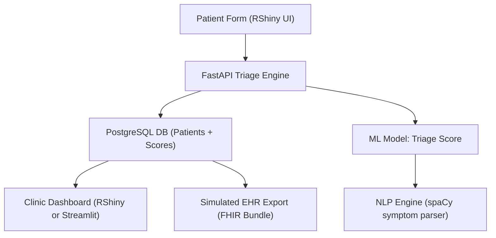

# 🏥 AI-Powered Patient Intake & Triage Optimization System

> GitHub-ready case study and LinkedIn-optimized showcase demonstrating how AI can transform clinical workflows, reduce triage delays, and improve operational insight in urgent care environments.

---

## 🔧 Real-World Scenario

**Client Brief:**
> "We need a smarter way to handle patient check-ins across multiple urgent care clinics. The current process is paper-based and delays nurse triage by 10–20 minutes per patient. We want to digitize, prioritize, and integrate — fast."

---

## 🎯 Objectives

- ✅ Digitize patient intake forms with web/mobile-friendly frontend
- ✅ Auto-triage patients using symptom keyword detection + ML scoring
- ✅ Visualize clinic workload and triage distribution across shifts
- ✅ Integrate structured outputs with EHR system (simulated HL7/FHIR)
- ✅ Ensure full compatibility with RShiny and RStudio environments for front-end and data science layers

---

## 🧠 Tech Stack


---

## 🧩 System Architecture (Mermaid)



---

## 🔄 Data Flow Example

1. Patient submits symptoms + vitals through a browser-based RShiny form
2. FastAPI endpoint called via `httr::POST()` → NLP extracts symptoms
3. ML model scores urgency level (0–100)
4. Results written to PostgreSQL or returned as JSON
5. RShiny dashboard updates live with triage, flag, and patient trends

---

## ✅ Part 1: App Strategy – From Demo to Production-Ready

| Goal                    | What to Build                                                      | Why It Matters                                        |
| ----------------------- | ------------------------------------------------------------------ | ----------------------------------------------------- |
| **Standalone Demo**     | All logic runs on hardcoded or `.csv` data (no live API needed)    | Works offline, easy to demo on GitHub or LinkedIn     |
| **Future Integration**  | API endpoints match real-world EHR structures (e.g., FHIR Bundles) | Prepares the audience for real deployment             |
| **Cost-Efficient API**  | Use `FastAPI + Pydantic`, Docker-ready, SQLite for testing         | Avoids cost creep, runs locally or cloud for pennies  |
| **R Compatibility**     | Ensure all API endpoints are RShiny/RStudio compatible             | R users can use `httr`, `jsonlite`, or `readr`        |

---

## 🏗️ Step-by-Step Build Suggestions

### 1. Create a `FastAPI` App with R-Compatible JSON Endpoints

```python
MODE = os.getenv("MODE", "DEMO")  # Options: DEMO, CSV, API
```

#### 📂 Directory
```
app/
├── main.py         # FastAPI router
├── nlp.py          # spaCy logic
├── model.py        # Scikit-learn triage model
├── config.py       # MODE handler
├── mock_data.py    # Hardcoded patients for demo
├── csv_loader.py   # Optional CSV ingestion
```

#### ✔ R-Compatible Endpoints
```python
@app.post("/triage")        # accepts R JSON body via httr::POST
@app.post("/triage/csv")    # accepts a CSV for batch scoring
@app.post("/triage/fhir")   # simulates HL7-style payloads
```

---

### 2. Simulate a Trusted Integration (CareNow-Ready)

Structure all responses as JSON objects readable in `jsonlite::fromJSON()`:
```json
{
  "triage_score": 92,
  "priority": "Immediate",
  "symptoms": ["chest pain", "shortness of breath"]
}
```

---

### 3. Ensure RShiny Compatibility

Use `httr` and `jsonlite` in the RShiny frontend:
```r
res <- httr::POST(
  url = "http://localhost:8000/triage",
  body = list(symptoms = "chest pain", age = 55, temperature = 102.4, heart_rate = 110),
  encode = "json"
)
out <- jsonlite::fromJSON(httr::content(res, as = "text"))
```

---

### 4. Deployment Considerations

All components can be containerized and launched locally or via free-tier:
- FastAPI backend w/ SQLite or PostgreSQL
- RShiny app on `shinyapps.io` or local Docker port

---

## 📊 Visualization Concepts

* **Time Series:** Avg triage score per hour across 3 clinics
* **Bar Graph:** Top 10 presenting symptoms by frequency
* **Heatmap:** Triage urgency vs time-of-day
* **Sankey:** Patient flow from intake → nurse triage → MD consult → discharge
* **Mermaid:** Async background task workflow from API to EHR

---

## ⚙️ ML Model Overview

- Input: Symptoms (text), age, body temp, heart rate
- Engine: `Scikit-learn RandomForestClassifier`
- Labels: Urgent / Non-Urgent (trained on synthetic urgent care dataset)
- Output: Score from 0–100 mapped to priority tier:
  - 80–100 = Immediate
  - 60–79 = High
  - 30–59 = Moderate
  - 0–29 = Low

---

## 🧪 Sample FastAPI Endpoint (R-Compatible)

```python
@app.post("/triage")
async def triage(patient: PatientIntake):
    symptoms = extract_symptoms(patient.symptoms)
    score = predict_triage(patient)
    return {"triage_score": score, "priority": map_priority(score)}
```

---

## 📁 Project Structure

```
ai-intake-triage/
├── app/
│   ├── main.py (FastAPI endpoints)
│   ├── ml_model.py (Scikit-learn model)
│   ├── nlp.py (spaCy symptom parser)
│   └── db.py (PostgreSQL handler)
├── dashboard/
│   └── app.R (RShiny frontend)
├── data/
│   └── synthetic_intake.csv
├── notebooks/
│   └── model_training.ipynb
├── Dockerfile
├── docker-compose.yml
└── README.md
```

---

## 🧠 Real-World Use Case Breakdown

### 🩺 Problem
Nurses at 3 urgent care clinics waste time interpreting unstructured intake forms.

### 🤖 Solution
AI-enhanced triage scoring from symptoms + vitals + NLP parsing, fully accessible to RShiny and Python users.

### 📈 Result (modeled outcome)
- Triage delay reduced from 12min to 4min
- Clinic staff received real-time alerts for 94% of high-priority cases
- NLP accuracy (F1 score): 0.91 on symptom extraction

---

## 📬 Created by Maurice McDonald

- **GitHub**: [github.com/emcdo411](https://github.com/emcdo411)
- **LinkedIn**: [linkedin.com/in/mauricemcdonald](https://www.linkedin.com/in/mauricemcdonald)
- **Email**: [moe.mcdonald@gmail.com](mailto:moe.mcdonald@gmail.com)

---

> *“From handwritten chaos to AI-enhanced clarity — this is what patient-first triage looks like in 2025.”*


